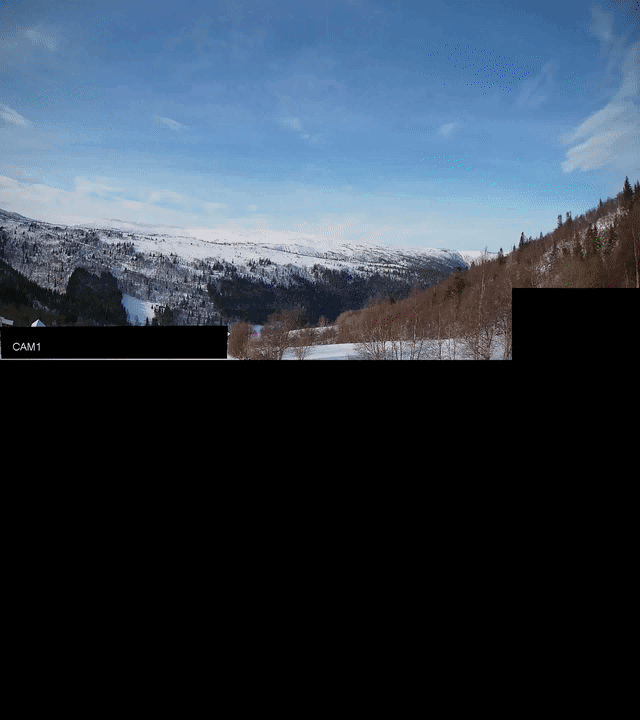
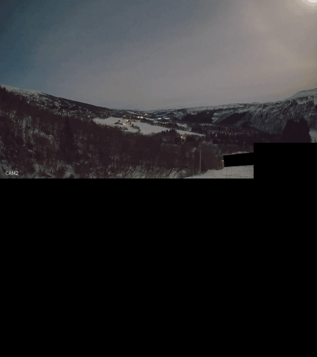

# Movement Detection

Movement detection system prototype for Project Hessdalen.

## Examples





## Installation

This project uses [uv](https://docs.astral.sh/uv/) for dependency management.

```bash
# Install dependencies
uv sync --group core --group dev --group test
```


## Usage

```bash
uv run python scripts/dev/detect_movement.py path/to/video.mp4 --output output_directory/
```

Run with `--help` for all available parameters.


## Configuration

`config/detector.toml` holds what a run starts from and what the
dashboard's sidebar opens on. Every value in it has a control of its own
on the page, and Save there writes the file, so tuning done on the
dashboard becomes a change to review and commit. The settings with no
control, such as the closing size and the noise floor, keep their values
with the settings class they belong to.

The tests read the same file, so the scene sweep measures whatever is
saved there against every scene it covers.


## Detection

Every pixel keeps a running mean, and a pixel counts towards a detection
once it departs from that mean by a given number of standard deviations.
The noise it is divided by is the larger of two estimates, with
`noise_floor` on `BackgroundSettings` under both at one grey level. One
is what the pixel's own residual has been over the frames before it. The
other is how far the residual spreads over the pixels around it,
measured on 16 by 16 blocks, with the block the pixel sits in and the
blocks touching it left out so an object does not raise the level it is
measured against.

The second estimate is there because of how the recordings are coded.
H.264 repeats a block verbatim while nothing in it changes, so a pixel in
a still part of the scene shows no noise to measure, and the estimate
over time falls to the floor on 98.8 to 99.99 percent of the frame. Every
keyframe then recodes the picture from scratch and moves those pixels
again, which a pixel measured against the frames before it reads as
movement. The pixels around it read it for what it is, because an object
covers a few blocks and a recoded picture covers all of them.

Either estimate on its own leaves a gap. The one over time is what holds
down foliage and a wind-blown horizon, where the same pixels move again
and again. The one over the neighbourhood is what holds down a recoded
picture, where everything moves at once.

`--detection-sigma` sets how far a blob's brightest pixel has to depart
from the background to be reported, and it is the first parameter to
reach for. Values between 12 and 20 all work on the example recordings.

Distances are given as a ratio of the frame's larger dimension rather
than in pixels, so `--max-movement-ratio` and its siblings hold their
meaning at any `--target-height`.


## Graphics card

The per-pixel stage of the detector runs on an NVIDIA card when CuPy is
installed and a card answers, and on the host otherwise.

```bash
uv sync --group core --group gpu
```

Over the example recordings at a frame height of 1080 the card cuts
detection time from 98.0 to 25.2 seconds, and all ten recordings report
the same frame numbers, track ids and centroids either way.

Set `device` on `MovementSettings` to `"cpu"` to stay on the host, or to
`"cuda"` to fail when no card answers.


## Dashboard

A debugging dashboard lists the recordings under `data/examples`, runs the
detector over one or all of them, and plays the result with the tracks
drawn on it. The sidebar chooses the panels a run draws: the recording,
the deviation it was measured against, or both stacked. Each panel costs
its own pass over the recording, so one panel runs in about half the time
of both.

```bash
uv run --group dashboard --group gpu streamlit run src/hessdalen/dashboard/app.py
```

Pick a recording by clicking its row, set the parameters in the sidebar
and press Run. Each run is stored under `data/out/dashboard` under the
settings it used, so a recording that has been run with the settings
currently in the sidebar plays back without running again. Set
`HESSDALEN_EXAMPLES_DIR` to list recordings from somewhere other than
`data/examples`.

Under the settings, Save writes everything the sidebar sets to
`config/detector.toml`, Reset puts the detection, tracking and
background sliders back to the values that file holds, Export writes
those same settings to a file of your own, and Import reads one back.
Frame height, panels and device are saved but left out of Reset, Export
and Import. An exported file may name as few settings as it likes, and
the sliders it does not name stay where they stand.

The Live switch builds a segment of the selected recording into a short
clip and loops it in the page, and moving any setting builds the segment
again under the new value. The clip plays at the rate it was written at,
which a frame pushed at a time cannot do, because nothing on the far
side holds those frames to a rate. A clip already built for the settings
in the sidebar plays at once, so two values can be compared without
waiting for either again, and the clip built last keeps playing while
the next one is built.

Only the segment is detected, so the background model opens on its first
frame and takes its scene from the frames after it. At a frame height of
1080 a clip under `data/examples/clips` builds in 2 to 4 seconds, and an
eight-second segment 41 seconds into a recording takes 5 to 10 seconds.
Most of the latter is spent reaching the segment, because neither
decoder lands on the frame a linear decode calls by that number on these
files, so everything before it has to be decoded. Built clips are kept
under `data/out/dashboard/live`, which can be deleted at any time.

A stored run and a live clip are both written through `ffmpeg` with
`libx264`, which has to be on PATH.


## Development

```bash
# Run tests
uv run pytest

# Linting and type checking
uv run ruff check .
uv run mypy src/

# Format code
uv run ruff format .
uv run docformatter . --recursive
```

## Data Management

This project uses DVC (Data Version Control) for managing example data and test datasets.

```bash
# Pull data from remote storage
dvc pull
```
